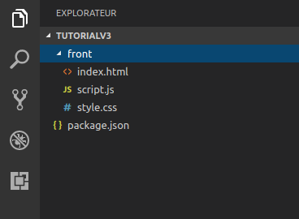
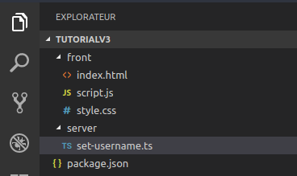

# Créer un chat temps-réel avec ZetaPush

## Objectif

L'objectif de ce tutoriel est de construire une application de chat en utilisant ZetaPush depuis le démarrage du projet jusqu'à son déploiement. 

Pour ceci tu vas découvrir comment utuliser les services ZetaPush existants (chat, gestion des utilisateurs). Ensuite, tu vas voir comment étendre toi même ces services pour développer les fonctionnalités précises que tu souhaites.


## Pré-requis

Pour suivre ce tutoriel, tu as simplement besoin d'un éditeur de texte de type Visual Studio Code, Atom ou encore Vim. Tu peux utiliser ton IDE préféré si tu le souhaite. Si tu n'as pas ou peu de compétences en développement ce n'est pas grave, nous allons partir du début.

## Tutoriel

* REMARQUE MMM - L'installation de NodeJs est hors scope

### Installation de nodejs / npm

Dans un premier temps, il est nécessaire d'avoir nodejs et npm d'installés sur sa machine. Suis ce lien pour procéder à l'installation : https://nodejs.org


### Initialisation du projet

Maintenant que tu as les outils nécessaires, créé ton application en suivant ces étapes :
```bash
    $ zeta new avengers-chat
```

Ensuite il te faut ajouter la dépendance à ZetaPush :
```bash
    $ cd avengers-chat
    $ npm install --save zetapush
```
À présent créé les différentes fichiers pour avoir le front de ton application :
```bash
    $ mkdir front
    $ cd front
    $ touch index.html style.css script.js
```
Voici l'arborescence que tu dois avoir suite à ces commandes :



Et maintenant remplis les différents fichiers :

#### index.html

TODO


#### style.css

TODO


#### script.js

Dans le fichier de script tu as simplement besoin pour l'instant d'initialiser la communication avec ZetaPush :

TODO    


### Utilisateur du service ZetaPush

Une fois le design de notre application fait, nous allons utiliser les services ZetaPush pour créer le fonctionnel de notre application de chat. 

Dans un premier temps nous devons faire en sorte d'appeler un service ZetaPush lorsqu'on envoi un message. Pour ceci saisi ce code dans `script.js` :
```javascript
    import ZetaPushClient from 'zetapush@core';

    const zpClient = new ZetaPushClient();

    const btnAddMsg = document.getElementById('btnAddMsg');
    const inputMsg = document.getElementById('inputMsg');

    zpClient.connect().then(() => {
        console.log('ZetaPush::ConnectionSuccessful');
    });

    btnAddMsg.addEventListener("click", () => {
        zpClient.callService.sendMessage(inputMsg.value);
    });
```
Ensuite il faut écouter les messages entrants pour les afficher à l'écran. Pour ceci saisi ce code dans `script.js` :
```javascript
    // Some code

    const conversation = document.getElementById('conversationArea');

    zpClient.connect().then(() => {
        console.log('ZetaPush::ConnectionSuccessful');

        zpClient.listenService('onMessage', (message) => {
            conversation.value += `\n ${message.author} (${message.timestamp}) >>> ${message.value}`;
        });
    });
```
Faisons aussi en sorte d'afficher lorsqu'un correspondant est en train d'écrire :
```javascript
    const displayUserTyping = document.getElementById('textUserTyping');

    let intervalTyping;

    zpClient.connect().then(() => {
        console.log('ZetaPush::ConnectionSuccessful');

        zpClient.listenService('onUserTyping', (author) => {
            clearInterval(intervalTyping);
            displayUserTyping.value = `${author} is typing...`;

            intervalTyping = setTimeout(() => {
                displayUserTyping.value = '';
            }, 3000);
        });
    });
```
Voici le code complet pour le chat avec ZetaPush :
```javascript
    import ZetaPushClient from 'zetapush@core';

    const zpClient = new ZetaPushClient();

    const conversation = document.getElementById('conversationArea');
    const btnAddMsg = document.getElementById('btnAddMsg');
    const inputMsg = document.getElementById('inputMsg');
    const displayUserTyping = document.getElementById('textUserTyping');

    let intervalTyping;

    zpClient.connect().then(() => {
        console.log('ZetaPush::ConnectionSuccessful');

        zpClient.listenService('onMessage', (message) => {
            conversation.value += `\n ${message.author} (${message.timestamp}) >>> ${message.value}`;
        });

        zpClient.listenService('onUserTyping', (author) => {
            clearInterval(intervalTyping);
            displayUserTyping.value = `${author} is typing...`;

            intervalTyping = setTimeout(() => {
                displayUserTyping.value = '';
            }, 3000);
        });
    });

    btnAddMsg.addEventListener("click", () => {
        zpClient.callService.sendMessage(inputMsg.value);
    });
```

Il ne te reste plus qu'à déployer pour discuter avec les Avengers !

### Déploiement du code sur ZetaPush

Pour déployer il suffit de se placer à la racine de notre application et d'exécuter :

    $ zeta push

Suite à ça tu peux suivre la progression du déploiement et une fois fini une URL t'es renvoyée et te donne accès à ton application déployée et fonctionnelle.

## Ajout de fonctionnalités

En dehors des services existants sur ZetaPush (voir la catégorie `Services existantes`), tu as aussi la possibilité d'étendre ton application avec tes propres fonctionnalités. Pour illustrer ceci, nous allons donner la possibilité aux utilisateurs de notre application de choisir son pseudo au sein du chat Avengers.

Pour ceci voici les modifications front à apporter pour permettre à l'utilisateur de saisir un nom :

### Partie front

#### index.html

// TODO

#### style.css

// TODO


### Création d'un service custom

L'extension de fonctionnalités passe par la création d'un service custom. C'est exactement la même chose qu'un service ZetaPush à la différence que c'est toi qui l'a créé.

Tu vas créer un nouveau fichier pour avoir une arborescence claire et différencier ton code front et ton code back.
```bash
    $ cd tutorialV3
    $ mkdir server
    $ cd server
    $ touch set-username.ts
```
Voici à quoi doit ressembler l'arborescence de fichier :




Maintenant créons notre service. Pour ceci saisi dans `set-username.ts` :

#### set-username.ts

    import ChatService from 'zetapush@server';

    function setUsername(name: string) extends ChatService {
        ChatService.displayedName = name;
    }


### Appel de notre service custom

À présent voici le code complet avec l'appel à notre service précédement créé pour se nommer sur le chat :

    // TODO


### Déploiement du code sur ZetaPush

Pour rendre ce rajout de fonctionnalités opérationel, nous devons à nouveau déployer notre code. Pour ceci nous refaisons : 

    $ zeta push

Cette commande déploie à la fois le code front et back.
Suite à ça, tu auras de nouveau une barre de progression pour suivre l'avancement du déploiement et une URL en retour pour accèder à ton application déployée.


# Conclusion

TODO : Conclusion tuto

TODO : Lien vers les services existants

TODO : Explication création service from scratch

