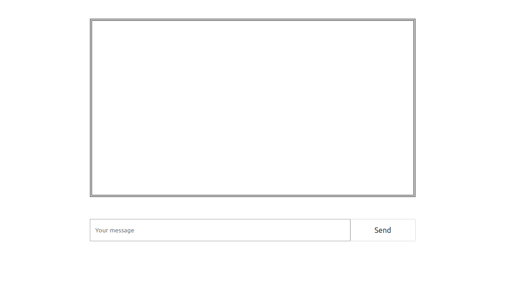

# Créer un chat temps-réel avec ZetaPush

## Sommaire

1. [Introduction](#introduction)
2. [Préparation de l'environnement](#préparation-de-lenvironnement)
3. [Initialisation du projet](#initialisation-du-projet)
4. [Création du design de l'application](#création-du-design-de-lapplication)
5. [Utilisation des _cloud services_](#utilisation-des-cloud-services)
6. [Déploiement de l'application](#déploiement-de-lapplication)
7. [Développement back avec ZetaPush](#développement-back-avec-zetapush)
8. [Utilisation d'un _custom cloud service_](#utilisation-dun-custom-cloud-service)
9. [Conclusion](#conclusion)

## Introduction

### Objectif

L'objectif de ce tutoriel est de construire une application de chat en utilisant ZetaPush depuis le démarrage du projet jusqu'à son déploiement.
Pour ceci tu vas découvrir comment utiliser les _cloud services_ de ZetaPush (chat, gestion des utilisateurs, etc...). Ensuite, tu vas voir comment développer toi même un service pour ajouter les fonctionnalités précises que tu souhaites.

### Pré-requis

Pour suivre ce tutoriel, tu as simplement besoin d'un éditeur de texte de type Visual Studio Code, Atom ou encore Vim. Tu peux utiliser l'IDE que tu souhaites. Si tu n'as pas ou peu de compétences en développement ce n'est pas grave, ce tutoriel est accessible à tous, quelque soit ton niveau.

À noter que dans ce tutoriel, tu écriras en _JavaScript_ pour plus de simplicité. En revanche pour tes futurs développements nous te recommandons d'utiliser _TypeScript_ puisque cela va te permettre d'utiliser d'avantage de fonctionnalités comme la génération de SDK ou de documentation par exemple. 

### Description du projet

Comme nous l'avons énoncé plus haut, tu vas créer une application de chat et plus précisément un **Avengers chat** ! Le but est d'avoir un chat en pouvant choisir son personnage des Avengers. Chaque Avengers aura une compétence qui lui sera associée et qu'il pourra utiliser sur le chat. Ce dernier sera une application web déployée et accessible via une URL unique.

Voici la liste des personnages d'Avengers avec leurs compétences :

| Personnage      | Compétences                             |
| :-------------: | :-------------------------------------: |
| Captain America | Lancer de bouclier / Guérison           |
| Oeil de Faucon  | Tir à l'arc / Super vision              |
| Iron Man        | Vol / Lance missile                     |
| Hulk            | Coup de poing / Régénération            |
| Thor            | Coup de marteau / Contrôle de la foudre |
| Spider-Man      | Lancé de toile / Web Shooters           |
| Wolverine       | Coup de griffes / Régénération          |


Voici le résultat final de l'application :

---
[CAPTURE ECRAN] Capture d'écran du chat lors de son utilisation avec plusieurs personnages et messages

---

Dans un premier temps tu vas préparer ton environnement de travail et initialiser un projet avec la CLI ZetaPush. La CLI est juste là pour te permettre d'aller plus vite, tu pourrais bien sur créer ton projet from scratch.

---
[CAPTURE ECRAN] Capture d'écran de la sortie de CLI qui génère un squelette de ton projet

---

Ensuite, tu vas réaliser la première partie du chat. C'est à dire créer un chat temps réel sans pouvoir choisir son personnage au démarrage de l'application. Pour ceci tu vas d'abord te concentrer sur le design de ton application web, puis tu vas apprendre à utiliser les _cloud services_ pour ajouter la partie fonctionnelle du chat.

---
[CAPTURE ECRAN] Capture d'écran du design de l'application, sans le choix des personnages, il y aura donc les id des utilisateurs d'affichés pour chaque message envoyé

---

À ce moment ton chat est prêt et fonctionnel, donc tu souhaiteras sûrement déployer ton application pour qu'elle soit accessible via une URL. C'est ici que tu vas découvrir la commande `zeta push` qui va te permettre d'exposer ton application en ligne.

---
[CAPTURE ECRAN] Capture d'écran de la sortie de la CLI après un `zeta push`

---

Ton chat fonctionne, mais ce que tu voulais c'est aussi de pouvoir choisir ton personnage des Avengers au lancement de ton application et découvrir sa compétence associée. Ce n'est pas un comportement fournit par défaut par ZetaPush, donc tu vas pouvoir créer cette fonctionnalité dans un _custom cloud service_ (présenté plus tard).

Une fois que tu as écrit et déployé ta fonctionnalité, tu vas pouvoir l'utiliser et déployer la nouvelle version de ton application.

---
[CAPTURE ECRAN] Capture d'écran de l'écran de sélection d'un personnage d'Avengers

---

Avec toutes ces étapes tu pourras chatter avec les Avengers !

---
[CAPTURE ECRAN] De retour la capture d'écran de l'application finie ?

---

## Préparation de l'environnement

Pour utiliser ZetaPush, tu n'as besoin d'aucune dépendances extérieures. En revanche, dans le cadre de ce tutoriel, nous allons utiliser la CLI ZetaPush (pour un gain de productivité). Tu auras donc besoin de _NodeJS_ (et implicitement _npm_) pour ceci. Il te faut donc installer _NodeJS_ via : https://nodejs.org

Une fois que c'est fait, tu vas pouvoir initialiser ton Avengers chat.


## Initialisation du projet

Pour initialiser ton application, tu as plusieurs possibilités. Tu peux utiliser le wizard disponible sur https://console.zetapush.com (En cours de développement) qui va te guider pas à pas, utiliser la CLI ou encore démarrer en créant manuellement les fichiers nécessaires. Ici tu vas directement utiliser la CLI pour aller au plus vite.

Pour utiliser la CLI, il va te falloir la dépendance _npm_ `@zetapush/cli`. Commence alors par initialiser un projet _npm_, et d'y installer la dépendance à la CLI de ZetaPush :

```bash
$ cd ~/workspace/
$ mkdir avengers-chat 
$ cd avengers-chat/
$ npm init
$ npm install --save @zetapush/cli
```

Une fois ton dossier prêt, lance la commande de génération d'un nouveau projet avec ZetaPush :

```bash
$ zeta new
```

Cette commande va te créer une arborescence de projet pour différencier ton code front et ton code back qui sera utilisé plus tard dans ce tutoriel (nous appellerons custom could services la partie back).
Le découpage en deux projets n'est pas obligatoire mais c'est une bonne pratique pour bien différencier les différentes composantes de ton application. De plus dans le cadre du tutoriel, ceci te permettra de bien comprendre les interactions entre le front et les customs services.


À présent ton application est prête à ếtre développée ! Commence par créer le design.

## Création du design de l'application

Dans cette section tu vas commencer par faire le design de ton Avengers Chat. Voici à quoi ça va ressembler :



Dans ce tutoriel ce n'est pas la partie design de l'application qui nous intéresse, donc voici les fichiers à utiliser, tu peux directement les copier-coller. À noter que nous avons ajouté un fichier `style.css` dans le sous-dossier `front`.

### **index.html**

```html
<!DOCTYPE html>
<html lang="en">

<head>
    <meta charset="UTF-8">
    <meta name="viewport" content="width=device-width, initial-scale=1.0">
    <meta http-equiv="X-UA-Compatible" content="ie=edge">
    <title>Avengers Chat</title>
    <link rel="stylesheet" href="https://cdnjs.cloudflare.com/ajax/libs/bulma/0.6.2/css/bulma.min.css">
    <link rel="stylesheet" href="./style.css">
</head>

<body>

</body>

</html>
<!DOCTYPE html>
<html lang="en">

<head>
    <meta charset="UTF-8">
    <meta name="viewport" content="width=device-width, initial-scale=1.0">
    <meta http-equiv="X-UA-Compatible" content="ie=edge">
    <title>Avengers Chat</title>
</head>

<body>
    <!-- Area where we add the messages -->
    <div class="content" id="conversation"></div>

    <div id="buttons">
        <input placeholder="Your message" />
        <button class="button">Send</button>
    </div>
    <script src="./index.js"></script>
</body>

</html>
```

### **style.css**

```css
body {
    display: flex;
    justify-content: start;
    flex-direction: column;
    align-items: center;
}

#buttons {
    display: flex;
    justify-content: flex-start;
    width: 70%;
    height: 5vh;
    max-width: 700px;
}

input {
    width: 80%;
    padding: 10px;
}

.button {
    width: 20%;
    height: 100%;
}

#conversation {
    margin: 5vh;
    border: 5px double grey;
    width: 70%;
    height: 40vh;
    max-width: 700px;
    padding: 10px;
    overflow-y: auto;
}
```

Le design est maintenant prêt, utilise à présent les _cloud services_ déjà existants sur ZetaPush pour rajouter le fonctionnel du chat.

## Utilisation des _cloud services_

Pour que ton chat fonctionne il te faut 3 choses dans ton application :
- Une connexion à la plateforme ZetaPush
- Un moyen d'envoyer un message
- Un moyen d'écouter les nouveaux messages

En ce qui concerne la connexion, tu vas te connecter auprès de ZetaPush en tant qu'utilisateur anonyme. C'est à dire que tu n'as pas besoin d'authentification au sein de ton application mais que tu as quand même accès aux _cloud services_.

Dans la plupart des cas tu utiliseras une connexion "standard" avec un couple login/mot de passe, mais ici, une connexion anonyme va te suffire. Voici comment procéder :

Il te faut d'abord ajouter la dépendance _npm_ pour utiliser les _cloud services_ :

```bash
$ cd avengers-chat/
$ npm install --save @zetapush/cli
```

### **front/index.js**

```javascript
// TODO: Code de connexion avec les détails de chaque objet
```

Ensuite, pour envoyer un message et recevoir les messages, tu vas pouvoir utiliser le _cloud service_ `ChatService` fourni par ZetaPush. Ce dernier va te fournir la _cloud function_ `sendMessage()` et l'évènement `onNewMessage()` pour répondre à ton besoin. Voici comment les utiliser :

### **front/index.js**

```javascript
// TODO: Utilisation de "sendMessage()" et de "onNewMessage()"
```

--- 
### _cloud services et cloud functions_

Petite précision concernant les _cloud services_ et les _cloud functions_. Un _cloud service_ est un ensemble de _cloud functions_ regroupées par thème. C'est à dire que nous avons des _cloud services_ pour le chat, la gestion d'utilisateurs, la remontée de données, etc... La _cloud function_ effectue une action précise, comme par exemple `createUser()`, `sendMessage()` ou encore `pushData()`.

La liste de l'ensemble des _cloud services_ existants est disponible sur https://console.zetapush.com/documentation

// TODO: Revoir le lien de la documentation

---

À présent voici le code source complet. Il est nécessaire d'établir une connexion avec ZetaPush pour appeler une _cloud function_.

### **front/index.js**

```javascript
// TODO: Connexion à la plateforme suivi de l'utilisation de "sendMessage()" et de "onNewMessage()"
```

Le fonctionnel de ton chat est maintenant fait, il te faut maintenant déployer ton application pour qu'elle soit accessible à tous.


## Déploiement de l'application

C'est ici que tu vas découvrir la commande `zeta push`. Cette dernière va te permettre, en une seule ligne, de déployer ton application et de te retourner une URL où ton front a été publié. Voici la démarche à suivre :

Pour l'instant nous avons seulement du code front, nous n'avons pas encore créé de _custom cloud service_ (tu verras en détails ce que c'est par la suite), donc voici la commande à exécuter :

// TODO: Revoir comment la commande `zeta push` sera réellement appelée

```bash
$ zeta push --front /path/of/your/front
```

Dans ton cas, si tu te positionne à la racine de ton application ça sera :

```bash
$ zeta push --front ./front
```

Cette commande va faire plusieurs choses :
- Te créer un compte sur la plateforme ZetaPush
- Créer ta nouvelle application
- Ajouter les _cloud services_ utiles à ton application (ici `ChatService`)
- Déployer le front sur une URL unique
- Brancher le front avec les _cloud services_

---
[CAPTURE ECRAN] Capture de la barre de progression de la CLI

---

Une fois le déploiement effectué, la CLI va te retourner plusieurs informations :
- URL unique de ton application
- login/password temporaire de ton compte sur la plateforme ZetaPush
- Période de validité de ton application

---

// TODO: Définir le process complet d'une application sans compte ZetaPush

// TODO: Définir le temps de validité d'une application "anonyme"

### Précisions

Dans ce tutoriel, tu as créé une application sans avoir de compte sur la plateforme ZetaPush. Dans ce cas, il y en a un qui est fourni par défaut, avec un couple login/mot de passe temporaire. Ton application est aussi temporaire, mais tu peux rapidement la rendre permanente en te connectant à https://console.zetapush.com avec ton couple login/mot de passe pour modifier tes identifiants et activer ton compte. Le fait d'avoir un compte ZetaPush va te permettre de regrouper toutes tes applications et de les exploiter d'avantage.

---

Tu peux maintenant te rendre sur l'URL fourni par la CLI et voir ton chat fonctionner !
Pour l'instant, nous ne gérons pas les utilisateurs donc ce sont les identifiants uniques par utilisateur qui sont affichés en tant que membre du chat. Tu vas y remédier tout de suite en ajoutant ta nouvelle fonctionnalité dans un _custom cloud service_.

## Développement back avec ZetaPush

À présent, tu vas créer ton propre code métier avec ZetaPush en utilisant JavaScript. Pour ceci tu vas créer un _custom cloud service_. 

---
### Précisions

Un _custom cloud service_ est exactement la même chose qu'un _cloud service_ sauf qu'ici, c'est toi qui va le créer. Une fois déployé sur ton application, tu vas pouvoir l'utiliser de la même manière qu'un _cloud service_.

---

Ton _custom cloud service_ va te servir dans un premier temps à choisir ton personnage des _Avengers_ quand tu accèdes au chat. Dans ce cas, tu vas utiliser la _cloud function_ `setUserName()` du _cloud service_ `UtilsService`. Cette dernière va te permettre de donner un nom à afficher pour l'utilisateur courant. Ensuite il faut associer une compétence à ton personnage, donc nous allons stocker l'information côté back, et nous utiliserons le _cloud service_ `StorageService`.

Pour ceci créé ton _custom cloud service_ dans **server/index.js**. Ton _custom cloud service_ se nommera `AvengersService` et tu auras les _cloud functions_ suivantes : `setAvengersName()` / `setSkillByAvengers()` / `getSkillByAvengers()`.

Tu pourrais créer cette logique métier côté front, mais c'est toujours une bonne pratique de mettre ton code fonctionnel, propre à ton application, côté back, surtout si tu décides d'avoir plusieurs fronts (Web, Android, iOS par exemple).

Nous faisons en sorte que la définition de la compétence pour chaque Avengers se fait au déploiement du code back.


### **server/index.js**

```javascript
// TODO: "AvengersService"
// TODO: "setAvengersName()"
// TODO: "setSkillByAvengers()"
// TODO: "getSkillByAvengers()"
```

Ton _custom cloud service_ est maintenant prêt, avant de l'utiliser déploies le. Ici, tu vas utiliser la commande `zeta push`, seulement pour déployer le côté back de ton application, voici la démarche à suivre :

// TODO: Revoir comment la commande `zeta push` sera réellement appelée

// TODO: Comment ajouter du code d'init dans un service ? Lancé au déploiement ?

```bash
$ zeta push --back /path/of/your/back
``` 

Dans ton cas, si tu te trouve à la racine du projet, il te faut lancer :

```bash
$ zeta push --back ./server/
```

Maintenant que ton _custom cloud service_ est disponible, utilises le !

## Utilisation d'un _custom cloud service_

Maintenant il faut que tu fasses en sorte de demander quel Avengers un utilisateur veut utiliser lorsqu'il se connecte. Ensuite il faut ajouter un bouton pour que chaque Avengers puisse utiliser sa compétence sur le chat !

// TODO: Ajouter ascii art pour matérialiser chaque compétence

Voici la nouvelle version des fichiers pour implémenter ces fonctionnalités. Tu peux voir que tu utilises exactement de la même manière un _custom cloud service_ et un _cloud service_.

### **front/index.js**

```javascript
// TODO:
```

### **index.html**

```javascript
// TODO:
```

Il ne te reste plus qu'à déployer la partie front de ton application :

// TODO: Revoir comment la commande `zeta push` sera réellement appelée

```bash
$ zeta push --front ./front
```

Si tu avais voulu déployer en même temps le back et le front tu aurais pu utiliser :

```bash
$ zeta push --back /path/of/your/back --front /path/of/your/front
``` 

## Conclusion

Ton **Avengers Chat** est prêt, tu vas pouvoir communiquer avec les Avengers ! 

Tout au long de ce tutoriel, tu as pu voir comment utiliser les _cloud services_ de ZetaPush et même créer tes propres fonctionnalités en utilisant les _custom cloud services_. 

À présent n'hésite pas à aller sur https://console.zetapush.com pour gérer ton application, ou voir les _cloud services_ disponibles chez ZetaPush. 

// TODO: Voir sur quoi on souhaite rediriger l'utilisateur pour qu'il découvre ZetaPush
